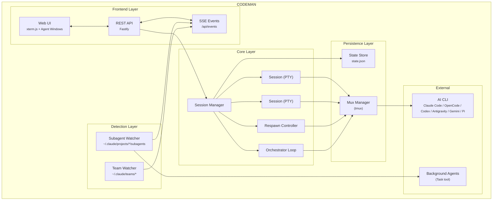

<p align="center">
  
</p>

<h2 align="center">Mission control for AI coding agents</h2>

<p align="center">
  <em>Claude Code &bull; OpenCode &bull; Codex &bull; Antigravity &bull; Gemini &bull; Pi &bull; Terminal - One Dashboard &bull; Any Device</em>
</p>

<p align="center">
  <a href="https://opensource.org/licenses/MIT"></a>
  <a href="https://nodejs.org/"></a>
  <a href="https://www.typescriptlang.org/"></a>
  <a href="https://fastify.dev/"></a>
  <a href="https://www.npmjs.com/package/aicodeman"></a>
  <a href="https://github.com/Ark0N/Codeman/stargazers"></a>
  <a href="https://github.com/Ark0N/Codeman/graphs/contributors"></a>
  <a href="https://github.com/Ark0N/Codeman/commits/master"></a>
</p>

<p align="center">
  <strong>English</strong> &bull; <a href="README.zh-CN.md">简体中文</a>
</p>

<p align="center">
  
</p>

**Codeman** is a self-hosted mission control for AI coding agents. It spawns Claude Code, OpenCode, Codex, Antigravity, Gemini, or Pi inside persistent tmux sessions, streams the real terminal to any browser, and keeps agents productive after you walk away: it re-prompts on idle, resumes when a usage limit resets, runs scheduled jobs, and shows every background agent working in real time.

Get started in one line (macOS & Linux, Windows via WSL):

```bash
curl -fsSL https://getcodeman.com/install | bash
```

```bash
codeman web
# Open http://localhost:3000 and start your first session
```

The installer asks before every system change, and re-running the same line updates in place. Full details: [Quick Start - Installation](#quick-start---installation).

- **One dashboard, six CLIs** - run [Claude Code, OpenCode, Codex, Antigravity, Gemini, or Pi](#more-features) per session (plus plain shell), locally, [in Docker](#isolated-docker-sessions), or [over SSH](#remote-ssh-sessions)
- **Truly phone-friendly** - a [touch-optimized terminal](#mobile-optimized-web-ui) with instant local echo, QR login, swipe navigation, and push notifications
- **Runs while you sleep** - [idle detection + respawn cycling](#respawn-controller) and auto-resume when a subscription limit resets, for 24+ hour unattended runs
- **See your agents think** - [live floating windows](#live-agent-visualization) for every subagent and teammate, with real-time transcripts
- **Nothing gets lost** - tmux persistence across restarts and network drops, exactly-once input delivery, full-scrollback replay
- **Self-hosted and private** - loopback-only by default, MIT licensed, no telemetry, runs entirely on your machine

<p align="center">
  
</p>

---

## Quick Start - Installation

```bash
curl -fsSL https://getcodeman.com/install | bash
```

This installs Node.js and tmux if missing, clones Codeman to `~/.codeman/app`, and builds it. A few things worth knowing:

- **It asks first.** Every system change (package installs, AI CLI download) is prompted, and a menu at the end lets you choose: run Codeman in this terminal, install it as a background service (systemd/launchd, auto-start on boot), or don't start yet. Nothing runs in the background unless you pick it.
- **Network or local-only, your choice.** The installer asks whether the dashboard should be reachable from other devices on your network (`0.0.0.0`, the default, with a strongly recommended password prompt) or from this machine only (`127.0.0.1`, safest). Skipping the password on a network bind requires an explicit confirmation and ends with a loud warning. A bare `codeman web` started by hand still defaults to loopback.
- **Re-run to update.** The same one-liner updates a finished install in place: local changes in `~/.codeman/app` are stashed (never discarded), and a running service is restarted and verified. If a first install was interrupted, re-running resumes the full setup instead. `install.sh update` and `install.sh uninstall` also exist.
- **CI / headless:** without a terminal attached, steps that would change your system abort with instructions instead of running silently. Set `CODEMAN_NONINTERACTIVE=1` to approve them for automation.

You'll need at least one AI coding CLI installed — [Claude Code](https://docs.anthropic.com/en/docs/claude-code), [OpenCode](https://opencode.ai), [Codex](https://developers.openai.com/codex/cli), [Antigravity](https://antigravity.google), [Gemini CLI](https://github.com/google-gemini/gemini-cli), or [Pi](https://pi.dev) (any combination works; Gemini CLI is enterprise-only since Google's consumer cutover, and Antigravity is its successor). The installer detects whichever of the six is present; if none is found, it offers to install Claude Code or OpenCode, or you can skip and install one yourself later. After install:

```bash
codeman web
# Open http://localhost:3000 and start your first session
```

**Sharing with a small team?** Start it in multi-user mode instead: each person gets their own login and workspace.

```bash
codeman users add alice --admin      # create the first admin account
codeman web --multiuser              # named logins + per-user case spaces
```

Details in [Multi-User Mode](#multi-user-mode-opt-in) below.

<details>
<summary><strong>Keep it running in the background</strong></summary>

To outlive the shell you started it in, without setting anything up:

```bash
codeman web -d          # detach; logs to ~/.codeman/web.log
codeman web --status    # is it up, and on which pid
codeman web --stop      # graceful SIGTERM; agents keep running in tmux
```

`-d` waits until the server actually answers before reporting success, and refuses to start a second one on the same data dir (two servers sharing a tmux socket attach to each other's sessions).

To have it come back after a reboot, install it as a service instead. The installer's final menu does this for you (option 2); `codeman service` is the equivalent for an `npm i -g aicodeman` install:

```bash
codeman service install     # systemd user unit (Linux) or LaunchAgent (macOS)
codeman service status
codeman service uninstall
```

`service install` writes the unit with your current PATH baked in, which matters more than it sounds: launchd hands a job `/usr/bin:/bin:/usr/sbin:/sbin`, so a Homebrew or nvm `node`, `tmux` or `claude` is invisible to a hand-written plist. It never copies `CODEMAN_PASSWORD` into the unit file; add that yourself if the service needs auth.

To write the unit by hand instead:

**Linux (systemd):**

```bash
mkdir -p ~/.config/systemd/user
cat > ~/.config/systemd/user/codeman-web.service << EOF
[Unit]
Description=Codeman Web Server
After=network.target

[Service]
Type=simple
ExecStart=$(which node) $HOME/.codeman/app/dist/index.js web
Restart=always
RestartSec=10

[Install]
WantedBy=default.target
EOF
systemctl --user daemon-reload
systemctl --user enable --now codeman-web
loginctl enable-linger $USER
```

**macOS (launchd):**

```bash
mkdir -p ~/Library/LaunchAgents
cat > ~/Library/LaunchAgents/com.codeman.web.plist << EOF
<?xml version="1.0" encoding="UTF-8"?>
<!DOCTYPE plist PUBLIC "-//Apple//DTD PLIST 1.0//EN"
  "http://www.apple.com/DTDs/PropertyList-1.0.dtd">
<plist version="1.0">
<dict>
  <key>Label</key>
  <string>com.codeman.web</string>
  <key>ProgramArguments</key>
  <array>
    <string>$(which node)</string>
    <string>$HOME/.codeman/app/dist/index.js</string>
    <string>web</string>
  </array>
  <key>RunAtLoad</key><true/>
  <key>KeepAlive</key><true/>
  <key>StandardOutPath</key>
  <string>/tmp/codeman.log</string>
  <key>StandardErrorPath</key>
  <string>/tmp/codeman.log</string>
</dict>
</plist>
EOF
launchctl bootstrap gui/$(id -u) ~/Library/LaunchAgents/com.codeman.web.plist
```

</details>

<details>
<summary><strong>Windows (WSL)</strong></summary>

```powershell
wsl bash -c "curl -fsSL https://getcodeman.com/install | bash"
```

Codeman requires tmux, so Windows users need [WSL](https://learn.microsoft.com/en-us/windows/wsl/install). If you don't have WSL yet: run `wsl --install` in an admin PowerShell, reboot, open Ubuntu, then install your preferred AI coding CLI inside WSL ([Claude Code](https://docs.anthropic.com/en/docs/claude-code), [OpenCode](https://opencode.ai), [Codex](https://developers.openai.com/codex/cli), [Antigravity](https://antigravity.google), [Gemini CLI](https://github.com/google-gemini/gemini-cli), or [Pi](https://pi.dev)). After installing, `http://localhost:3000` is accessible from your Windows browser.

</details>

---

## Mobile-Optimized Web UI

The most responsive AI coding agent experience on any phone. Full xterm.js terminal with local echo, swipe navigation, and a touch-optimized interface designed for real remote work — not a desktop UI crammed onto a small screen.

<table>
<tr>
<td align="center" width="40%"></td>
<td align="center" width="60%"></td>
</tr>
<tr>
<td align="center"><em>Answering prompts by touch</em></td>
<td align="center"><em>Accessory bar + dedicated Enter button</em></td>
</tr>
</table>

<table>
<tr>
<th>Terminal Apps</th>
<th>Codeman Mobile</th>
</tr>
<tr><td>200-300ms input lag over remote</td><td><b>Local echo — instant feedback</b></td></tr>
<tr><td>Tiny text, no context</td><td>Full xterm.js terminal</td></tr>
<tr><td>No session management</td><td>Swipe between sessions</td></tr>
<tr><td>No notifications</td><td>Push alerts for approvals and idle</td></tr>
<tr><td>Manual reconnect</td><td>tmux persistence</td></tr>
<tr><td>No agent visibility</td><td>Background agents in real-time</td></tr>
<tr><td>Copy-paste slash commands</td><td>One-tap <code>/init</code>, <code>/clear</code>, <code>/compact</code></td></tr>
<tr><td>Password typing on phone</td><td><b>QR code scan — instant auth</b></td></tr>
</table>

- **Keyboard accessory bar** — `/init`, `/clear`, `/compact` quick-action buttons above the virtual keyboard; destructive commands require a double-press to confirm, so you never fire one by accident
- **Dedicated Enter button** — replays the keypress through the terminal, so text buffered by local echo is flushed first rather than stranded
- **Swipe navigation & smart keyboard handling** — swipe left/right to switch sessions; toolbar and terminal shift up when the keyboard opens (`visualViewport` API)
- **Built for phones** — safe-area insets for notch and home indicator, 44px touch targets, bottom-sheet case picker, native momentum scrolling

```bash
codeman web --https
# Open on your phone: https://<your-ip>:3000
```

> `localhost` works over plain HTTP. Use `--https` when accessing from another device, or use [Tailscale](https://tailscale.com/) (recommended): the installer can set it up for you (choose **Tailscale** at the network-access prompt, or run `bash ~/.codeman/app/install.sh tailscale` on an existing install). That gives you `https://<your-machine>.<tailnet>.ts.net` with a real certificate: private to your tailnet, no password required, and PWA install + push notifications work on your phone.

### Secure QR Code Authentication

Typing passwords on a phone keyboard is miserable. Codeman replaces it with **cryptographically secure single-use QR tokens** — scan the code displayed on your desktop and your phone is authenticated instantly.

Each QR encodes a URL containing a 6-character short code that maps to a 256-bit secret (`crypto.randomBytes(32)`) on the server. Tokens auto-rotate every **60 seconds**, are **atomically consumed on first scan** (replays always fail), and use **hash-based `Map.get()` lookup** that leaks nothing through response timing. The short code is an opaque pointer — the real secret never appears in browser history, `Referer` headers, or Cloudflare edge logs.

The security design addresses all 6 critical QR auth flaws identified in ["Demystifying the (In)Security of QR Code-based Login"](https://www.usenix.org/conference/usenixsecurity25/presentation/zhang-xin) (USENIX Security 2025, which found 47 of the top-100 websites vulnerable): single-use enforcement, short TTL, cryptographic randomness, server-side generation, real-time desktop notification on scan (QRLjacking detection), and IP + User-Agent session binding with manual revocation. Dual-layer rate limiting (per-IP + global) makes brute force infeasible across 62^6 = 56.8 billion possible codes. Full security analysis: [`docs/qr-auth-plan.md`](docs/qr-auth-plan.md)

---

## Using Codeman — A Human's Guide

A start-to-finish walkthrough for driving Codeman from the browser. If you just installed, this is where to begin.

### 1. Launch the server

```bash
codeman web                       # localhost:3000 (loopback only — safe default)
codeman web --port 8080           # custom port (or set CODEMAN_PORT)
codeman web --https               # self-signed TLS (only needed for remote access)
codeman web -H 0.0.0.0            # bind LAN — REQUIRES CODEMAN_PASSWORD (see Security)
codeman web -d                    # detach: survives closing the shell (--status, --stop)
codeman service install           # systemd/launchd service: comes back after reboots
```

Open the printed URL. The page is a single dashboard; everything below happens there.

### 2. Create your first session

Click **+ New Session** (or **Quick Start**). A session is one AI CLI running in its own tmux-backed terminal. You choose:

| Field                        | What it does                                                                                                        |
| ---------------------------- | ------------------------------------------------------------------------------------------------------------------- |
| **Working directory / case** | The folder the agent operates in. A "case" is just a named working dir Codeman remembers. **Add Case** creates one from scratch, links an existing folder, or clones a GitHub repo straight into one (**Clone Repo**). |
| **CLI / run mode**           | `Claude` (default), `OpenCode`, `Codex`, `Antigravity`, `Gemini`, `Pi`, or `Terminal` (plain shell).                 |
| **Model**                    | Per-session model (App Settings → Models → New Claude sessions). A soft default — `/model` still works in-session.                  |
| **Effort / Ultracode**       | Reasoning effort (`low`–`max`) or `ultracode` for dynamic multi-agent workflows. Switchable anytime with `/effort`. |

Hit start — Codeman spawns the CLI via a real PTY and streams it to your browser over SSE.

### 3. Read the dashboard

- **Tabs (top)** — one per session. `Alt+1`-`9` to jump, `Ctrl+Tab` for next, drag to reorder (tab order syncs across your devices).
- **Terminal (center)** — a real `xterm.js` terminal; full TUIs render correctly. Type directly and press **Enter** to send. `Shift+Enter` inserts a newline.
- **Side panels** — Respawn, Orchestrator, Cron, Subagents, Settings (toggled from the toolbar).

### 4. Talk to the agent

- **Type prompts** straight into the terminal — input is delivered exactly-once even across reconnects (a dropped link never loses or double-sends a prompt).
- **Paste or drag-and-drop images** directly into the session.
- **Voice input** — `Ctrl+Shift+V` (Deepgram Nova-3, with auto-silence stop).
- **Attachments** — register external files/docs and preview Office/PDF inline.

### 5. Make it autonomous

| Mode             | Use it for                                                                                                                        | Where                                                               |
| ---------------- | --------------------------------------------------------------------------------------------------------------------------------- | ------------------------------------------------------------------- |
| **Respawn**      | Long unattended runs — auto-restarts the CLI on idle/limit, with adaptive timing. Presets: `solo-work`, `overnight-autonomous`, … | Respawn tab                                                         |
| **Orchestrator** | Turn one goal into a phased plan and drive it to completion across agents.                                                        | Orchestrator panel                                                  |
| **Cron**         | Saved, named jobs on a schedule (`once`/`interval`/`daily`/`weekly`) that spawn a session and send a prompt when due.             | ⏰ Cron button _(opt-in: App Settings → Header & Panels → Scheduling)_ |
| **Auto-resume**  | Automatically continue after a subscription rate-limit resets.                                                                    | Respawn tab (top)                                                   |

### 6. Reach it from anywhere

- **Phone/tablet** — the UI is fully touch-optimized; scan the desktop **QR code** to log in without typing a password.
- **Outside your network** — `./scripts/tunnel.sh start` opens a Cloudflare tunnel (set `CODEMAN_PASSWORD` first).
- **SSH** — the `sc` chooser attaches to any session from a terminal (`sc` interactive, `sc 2` quick-attach, `sc -l` list).

### 7. Operate & maintain

- **App Settings** — model, effort, permission startup mode, theme/skin, notifications, display toggles, per-CLI options, a synced custom display name, and per-device English/Simplified Chinese UI language.
- **Run it in the background** — `codeman web -d` detaches from your shell (`--status`, `--stop`); `codeman service install` makes it a systemd user unit / macOS LaunchAgent that survives reboots. Both verify the server actually answers before reporting success, and both refuse to start a second server on one data dir. See [Keep it running in the background](#quick-start---installation).
- **Self-update** — git-clone installs update in place from **App Settings → System → Updates**.
- **Deploy your own changes** — see [Development](#development).

> ⚠️ **Safety:** if you're working _inside_ a Codeman-managed session (`echo $CODEMAN_MUX` → `1`), never run `tmux kill-session` / `pkill claude` directly — use the web UI or `./scripts/tmux-manager.sh`.

---

## Zero-Lag Input Overlay

<p align="center">
  
</p>

When accessing your coding agent remotely (VPN, Tailscale, SSH tunnel), every keystroke normally takes 200-300ms to round-trip. Codeman implements a **Mosh-inspired local echo system** that makes typing feel instant regardless of latency.

A pixel-perfect DOM overlay inside xterm.js renders keystrokes at 0ms. Background forwarding silently sends every character to the PTY in 50ms debounced batches, so Tab completion, `Ctrl+R` history search, and all shell features work normally. When the server echo arrives 200-300ms later, the overlay seamlessly disappears and the real terminal text takes over — the transition is invisible.

- **Ink-proof architecture** — lives as a `<span>` at z-index 7 inside `.xterm-screen`, completely immune to Ink's constant screen redraws (two previous attempts using `terminal.write()` failed because Ink corrupts injected buffer content)
- **Font-matched rendering** — reads `fontFamily`, `fontSize`, `fontWeight`, and `letterSpacing` from xterm.js computed styles so overlay text is visually indistinguishable from real terminal output
- **Full editing** — backspace, retype, paste (multi-char), cursor tracking, multi-line wrap when input exceeds terminal width
- **Persistent across reconnects** — unsent input survives page reloads via localStorage
- **Enabled by default** — works on both desktop and mobile, during idle and busy sessions

> Extracted as a standalone library: [`xterm-zerolag-input`](https://www.npmjs.com/package/xterm-zerolag-input) — see [Published Packages](#published-packages).

---

## Live Agent Visualization

Watch background agents work in real-time. Codeman monitors agent activity and displays each agent in a draggable floating window with animated Matrix-style connection lines back to the parent session.

<p align="center">
  
</p>

- **Floating terminal windows** — draggable, resizable panels for each agent with a live activity log showing every tool call, file read, and progress update as it happens
- **Connection lines** — animated green lines linking parent sessions to their child agents, updating in real-time as agents spawn and complete
- **Status & model badges** — green (active), yellow (idle), blue (completed) indicators with Haiku/Sonnet/Opus model color coding
- **Auto-behavior** — windows auto-open on spawn, auto-minimize on completion, tab badge shows "AGENT" or "AGENTS (n)" count
- **Nested agents** — supports 3-level hierarchies (lead session -> teammate agents -> sub-subagents)

Multi-agent Workflow runs ("ultracode") get the same treatment: a floating run window tracks the whole workflow live, with phases, per-agent token counts, and the current tool of every agent:

<p align="center">
  
</p>

**Agent Teams** — first-class support for Claude Code's native multi-agent teams (`CLAUDE_CODE_EXPERIMENTAL_AGENT_TEAMS=1`). `TeamWatcher` polls `~/.claude/teams/`, matches teammates to their lead session, and surfaces them as live subagent windows with **team-aware idle detection** — so the Respawn Controller won't fire while teammates are still working. See [`docs/agent-teams/`](docs/agent-teams/).

---

## Respawn Controller

The core of autonomous work. When the agent goes idle, the Respawn Controller detects it, sends a continue prompt, cycles context management commands for fresh context, and resumes — running **24+ hours** completely unattended.

```
WATCHING → IDLE DETECTED → SEND UPDATE → /clear → /init → CONTINUE → WATCHING
```

- **Multi-layer idle detection** — completion messages, AI-powered idle check, output silence, token stability
- **Auto-resume on usage limit** _(opt-in, off by default)_ — when Claude halts on a subscription limit ("You've hit your limit · resets 3pm"), Codeman parses the reset time, waits it out plus a 2-minute safety buffer, then dismisses the rate-limit dialog and sends `continue` — so an overnight run survives the 5-hour window instead of stalling until morning. Recognizes every Claude Code limit-message format, retries if still limited, survives Codeman restarts, and holds respawn cycles while paused so `/clear` can't wipe the waiting conversation. Enable per session at the top of the Respawn tab
- **Circuit breaker** — prevents respawn thrashing when Claude is stuck (CLOSED -> HALF_OPEN -> OPEN states, tracks consecutive no-progress and repeated errors)
- **Health scoring** — 0-100 health score with component scores for cycle success, circuit breaker state, iteration progress, and stuck recovery
- **Built-in presets** — `solo-work` (3s idle, 60min), `subagent-workflow` (45s, 240min), `team-lead` (90s, 480min), `ralph-todo` (8s, 480min), `overnight-autonomous` (10s, 480min)

---

## Orchestrator Loop

Beyond single-session respawn, the **Orchestrator** turns a high-level goal into a phased plan and drives it to completion across multiple agents — a state machine that runs `idle → planning → approval → executing → verifying → (replanning) → completed`.

- **Plan, then execute** — generates a phased plan from your goal and pauses for approval before touching anything; reject with feedback to regenerate
- **Per-phase verification gates** — each phase is verified before the next begins; on failure the orchestrator replans instead of barreling ahead
- **Multi-agent execution** — fans phases out to team agents / a task queue, coordinating work too big for one session
- **Crash-safe** — full state persists under the `orchestrator` key in `state.json`, so it survives restarts
- **Driven from the UI or API** — the Orchestrator panel, or `POST /api/orchestrator/start` → `/approve` → `/status` (10 endpoints)

> Full design: [`docs/orchestrator-loop-architecture.md`](docs/orchestrator-loop-architecture.md).

---

## Multi-Session Dashboard

Run **20 parallel sessions** with full visibility — real-time xterm.js terminals at 60fps, per-session token and cost tracking, tab-based navigation, and one-click management.

### Persistent Sessions

Every session runs inside **tmux** — sessions survive server restarts, network drops, and machine sleep. Auto-recovery on startup with dual redundancy. Ghost session discovery finds orphaned tmux sessions. Managed sessions are environment-tagged so the agent won't kill its own session.

### Session Manager & Command Palette

`Ctrl/Cmd/Alt+K` opens a fuzzy session palette; **Browse all sessions** opens the Session Manager: one deduped list of everything Codeman knows about (live sessions, past sessions from state and lifecycle history, and Claude transcripts), each row showing its first and most recent prompt.

- **Pinning**: pin a session to float it to the top of the list. Pinned sessions even survive kill (they demote to a lightweight stopped entry that stays visible and resumable).
- **Name retention**: resuming a past session keeps its original name instead of minting a new one.
- **Cross-device tab order**: drag-reordered tabs persist server-side, so your ordering follows you from desktop to phone.

### Hostname-Aware Window Title

Running Codeman on multiple hosts (laptop, dev box, NAS)? The browser tab title is `codeman:<hostname>` so you can tell which backend each tab points at without clicking in:

```bash
codeman web                                # codeman:<os.hostname()>
codeman web --title-hostname dev-box       # codeman:dev-box (manual override for noisy hostnames)
```

The title is templated into the served HTML on first byte, so it's correct from the very first paint and works without JavaScript. The same hostname prefix is applied to the tab-flash format (`⚠️ (N) codeman:<host>`) and to OS-level desktop notifications (`codeman:<host>: <event>`), so cross-host alerts in the system notification center are also unambiguous.

### Smart Token Management

| Threshold       | Action          | Result                             |
| --------------- | --------------- | ---------------------------------- |
| **110k tokens** | Auto `/compact` | Context summarized, work continues |
| **140k tokens** | Auto `/clear`   | Fresh start with `/init`           |

### Tab Alerts

<p align="center">
  
</p>

Every tab tells you its state at a glance. A running session keeps its green status dot. When a session stops and waits for input, its tab turns **yellow**: steady ring, tinted background, yellow dot, with a slow breathing glow on top. When a permission prompt or question is **blocking** the agent, the tab turns **red** with a faster pulse. The base tint never blinks off, so even a split-second glance (or a screenshot) reads the true state; the ring stays visible while the tab is selected, and a page reload re-arms pending alerts from the server, so a blocked session can never hide behind a fresh-looking tab.

### Notifications

Real-time desktop alerts when sessions need attention — `permission_prompt` and `elicitation_dialog` trigger critical red tab blinks, `idle_prompt` triggers yellow blinks. Click any notification to jump directly to the affected session. Hooks auto-configured per case directory.

### Run Summary

Click the chart icon on any session tab to see a timeline of everything that happened — respawn cycles, token milestones, auto-compact triggers, idle/working transitions, hook events, errors, and more.

### Zero-Flicker Terminal

Terminal-based AI agents (Claude Code's Ink, OpenCode's Bubble Tea) redraw the screen on every state change. Codeman implements a 6-layer anti-flicker pipeline for smooth 60fps output across all sessions:

```
PTY Output → 16ms Server Batch → DEC 2026 Wrap → SSE → Client rAF → xterm.js (60fps)
```

---

## More Features

- **Background daemon & service install** — `codeman web -d` runs the server detached with a pidfile, `~/.codeman/web.log`, and verified startup (it polls the server until it answers, so a port clash never reads as success); `codeman service install` writes a systemd user unit (Linux) or LaunchAgent (macOS) with your shell's PATH baked in, so an nvm or Homebrew `node`, `tmux` and `claude` are actually found. Secrets are never written into unit files
- **Self-update** — git-clone installs under systemd/launchd update in place from **App Settings → System → Updates**: it detects the latest release, auto-stashes a dirty tree, and streams build progress across the service restart (npm installs report as non-updatable)
- **Clone a GitHub repo as a case** — paste a repository URL into **Add Case → Clone Repo** and Codeman clones it into `~/codeman-cases/<name>` and registers it as a normal case, ready to run an agent in. It preflights the URL while you type (tells you whether it can be cloned anonymously and offers the repo's real branches and tags for the optional branch/tag field), fills the case name in from the URL, and lets you pick which CLI the Run button should use. Public repositories over `https://`; Codeman never collects or stores credentials
- **Multi-CLI** — run **Claude Code**, **OpenCode**, **Codex**, **Antigravity**, **Gemini**, or **Pi** per session; env-var prefixes auto-gate (`CLAUDE_CODE_*` vs `OPENCODE_*` vs `CODEX_*` vs `ANTIGRAVITY_*` vs `GEMINI_*`/`GOOGLE_*` vs `PI_*`). See [`docs/opencode-integration.md`](docs/opencode-integration.md) and [`docs/pi-integration.md`](docs/pi-integration.md)
- **Docker sessions** — run a case inside an isolated, hardened container. One checkbox on **Create New** spins up a container with sensible defaults and starts the agent inside it; multiple sessions share one per-case container; export a container + its workspace to a portable `.tar.gz` to move it to another machine. See [`docs/docker-cases.md`](docs/docker-cases.md)
- **Remote SSH sessions** — point a case at another machine and run the agent there inside a durable remote tmux: survives SSH drops, auto-reconnects, and can discover + attach sessions already running on the host. See [`docs/remote-sessions.md`](docs/remote-sessions.md)
- **Effort & Ultracode** — set a per-session default effort (`low`–`max`) or enable **ultracode** (dynamic multi-agent workflows). Soft defaults only — switchable anytime with `/effort` in-session. Extended-thinking budget is configurable too
- **Voice input** — dictate prompts with Deepgram Nova-3 (Web Speech API fallback): toggle recording, auto-silence stop, live level meter (`Ctrl+Shift+V`)
- **Image input** — paste or drag-and-drop images straight into a session
- **Gesture control** _(opt-in)_ — a MediaPipe hand-tracking overlay to grab/drag session windows and pinch buttons, hands-free. Enable with `CODEMAN_GESTURE=1` + App Settings → Terminal & Input
- **Multi-monitor span** _(macOS)_ — one click opens a browser window maximized across all displays, so floating agent/gesture panels can cross the physical seam
- **File Viewer button** _(opt-in)_ — a header button that toggles the built-in file browser panel with one tap; enable under App Settings → Header & Panels → Header buttons
- **CJK / IME input** — full composition support for Chinese / Japanese / Korean
- **OS notifications & hostname-aware titles** — desktop alerts and tab titles are prefixed `codeman:<host>` so multi-host setups stay unambiguous

---

## Isolated Docker Sessions

Run a case inside its own hardened Docker container instead of directly on your host — for security isolation, reproducible toolchains, and one-click portability.

- **One click** — on **New Case → Create New**, tick **🐳 Run in an isolated Docker container**. Codeman creates the case folder, spins up a container with default settings, and starts the agent inside it. No host/image/network fields to fill in.
- **Resource templates** — expand the checkbox for a **Small / Medium / Large / GPU** preset (memory, CPUs, GPU), or set your own. **Disk is elastic** — storage grows as data flows in, no fixed cap.
- **Shared per-case container** — many sessions can `docker exec` into the same container; killing one session never tears the container out from under the others.
- **Hardened by default** — non-root, `--cap-drop ALL`, `no-new-privileges`, PID/memory caps, never `--privileged` or the docker socket; a **sealed** profile (no host credentials, network off) is one toggle away.
- **Seamless auth, isolated credentials** — your host Claude / Codex / Antigravity / Gemini / OpenCode / Pi logins work inside the container out of the box: credentials are seeded (copied) in at launch and onboarding/trust prompts are pre-answered, so no login wizard appears. The container keeps its own copies and never writes back to your host credential stores; only conversation transcripts are shared, and exports never capture secrets.
- **Move it to another machine** — export a container's whole environment (toolchain + workspace) to a portable `.tar.gz`, `docker load` it on the other side, and import it into a fresh case.
- **Durable** — reconnect after a restart lands back in the same live agent; a container stop/reboot resumes the conversation from the bind-mounted transcript.

Prerequisite: just Docker (or Podman). The agent base image builds itself automatically on first use, with progress streamed to the UI (or pre-build it with `node scripts/build-agent-image.mjs`). Full guide: [`docs/docker-cases.md`](docs/docker-cases.md).

---

## Remote SSH Sessions

Point a case at another machine and run the agent **there**, over SSH, with the same dashboard, mobile UI, and autonomy features. Your laptop is just a window onto a session that lives on the remote host.

- **Durable by design**: the agent runs inside a dedicated tmux session on the remote host, so a dropped SSH connection, network change, or laptop sleep never kills the run. Reconnecting lands back in the same live conversation.
- **Auto-reconnect**: a bounded-backoff watcher notices a dead SSH pane and silently reattaches to the still-running remote session (kill-switch in settings; intentional kills are never revived).
- **Discover & attach**: list the `codeman-*` sessions already running on a host (started by that machine's own Codeman, or by another operator) and attach to one. Attached sessions you don't own **detach on tab close, never kill**.
- **Shared sessions**: several clients can attach the same remote session at different window sizes without clamping each other; discovery shows a "shared" badge with the client count.
- **Injection-safe**: every ssh command line flows through a single shell-escaping builder, and host/path/identity fields are schema-guarded.

Set it up under **New Case → Remote** (host, user, identity file, optional jump host). Full design: [`docs/remote-sessions.md`](docs/remote-sessions.md).

---

## Multi-User Mode (opt-in)

Share one Codeman with a small trusted team, each person getting their own login and workspace. **Off by default** — without the flag, nothing changes.

Enable with `codeman web --multiuser` (or `CODEMAN_MULTIUSER=1`). Create the first admin, then manage users from the CLI or the **Users** tab in App Settings:

```bash
codeman users add alice --admin      # prompts for a password (or --password-stdin)
codeman users add bob                # a regular user
codeman users list
```

- **Per-user spaces** — each user's cases live under `~/codeman-users/<name>/cases`; sessions, cases, search, and real-time events are scoped to their owner. Admins see everything.
- **Individually revocable logins** — named users with scrypt-hashed passwords in `~/.codeman/users.json`; disable, reset (one-time password), or delete an account at any time. Admin actions are audited to `~/.codeman/admin-audit.jsonl`.
- **Safer defaults for regular users** — non-admins run Claude in `--permission-mode auto` (Anthropic's classifier-guarded mode); raw shell sessions, cron `launchCommand`, and skip-permissions require an explicit per-user grant.

> ⚠️ **This separates workspaces; it does not sandbox users from each other.** Every session runs as the same OS account, so a determined user's agent can still reach another user's files. For real isolation, pair users with **Docker cases** or run separate instances under separate OS accounts. See [`docs/multi-user-plan.md`](docs/multi-user-plan.md) and the multi-user section of [`docs/security-architecture.md`](docs/security-architecture.md).

---

## Remote Access — Cloudflare Tunnel

Access Codeman from your phone or any device outside your local network using a free [Cloudflare quick tunnel](https://developers.cloudflare.com/cloudflare-one/connections/connect-networks/do-more-with-tunnels/trycloudflare/) — no port forwarding, no DNS, no static IP required.

```
Browser (phone/tablet) → Cloudflare Edge (HTTPS) → cloudflared → localhost:3000
```

**Prerequisites:** Install [`cloudflared`](https://developers.cloudflare.com/cloudflare-one/connections/connect-networks/downloads/) and set `CODEMAN_PASSWORD` in your environment.

```bash
# Quick start
./scripts/tunnel.sh start      # Start tunnel, prints public URL
./scripts/tunnel.sh url        # Show current URL
./scripts/tunnel.sh stop       # Stop tunnel
./scripts/tunnel.sh status     # Service status + URL
```

The script auto-installs a systemd user service on first run. The tunnel URL is a randomly generated `*.trycloudflare.com` address that changes each time the tunnel restarts.

<details>
<summary><strong>Persistent tunnel (survives reboots)</strong></summary>

```bash
# Enable as a persistent service
systemctl --user enable codeman-tunnel
loginctl enable-linger $USER

# Or via the Codeman web UI: App Settings → System → Remote access → Cloudflare Tunnel
```

</details>

<details>
<summary><strong>Authentication</strong></summary>

1. First request → browser shows Basic Auth prompt (username: `admin` or `CODEMAN_USERNAME`)
2. On success → server issues a `codeman_session` cookie (24h TTL, auto-extends on activity)
3. Subsequent requests authenticate silently via cookie
4. 10 failed attempts per IP → 429 rate limit (15-minute decay)

**Always set `CODEMAN_PASSWORD`** before exposing via tunnel — without it, anyone with the URL has full access to your sessions.

</details>

### QR Code Authentication

Typing a password on a phone keyboard is terrible. Codeman solves this with **ephemeral single-use QR tokens** — scan the code on your desktop, and your phone is instantly authenticated. No password prompt, no typing, no clipboard.

```
Desktop displays QR  →  Phone scans  →  GET /q/Xk9mQ3  →  Server validates
→  Token atomically consumed (single-use)  →  Session cookie issued  →  302 to /
→  Desktop notified: "Device authenticated via QR"  →  New QR auto-generated
```

Someone who only has the bare tunnel URL (without the QR) still hits the standard password prompt. The QR is the fast path; the password is the fallback.

#### How It Works

The server maintains a rotating pool of short-lived, single-use tokens. Each token consists of a 256-bit secret (`crypto.randomBytes(32)`) paired with a 6-character base62 short code used as an opaque lookup key in the URL path. The QR code encodes a URL like `https://abc-xyz.trycloudflare.com/q/Xk9mQ3` — the short code is a pointer, not the secret itself, so it never leaks through browser history, `Referer` headers, or Cloudflare edge logs.

Every **60 seconds**, the server automatically rotates to a fresh token. The previous token remains valid for a **90-second grace period** to handle the race where you scan right as rotation happens — after that, it's dead. Each token is **single-use**: the moment a phone successfully scans it, the token is atomically consumed and a new one is immediately generated for the desktop display.

#### Security Design

The design is informed by ["Demystifying the (In)Security of QR Code-based Login"](https://www.usenix.org/conference/usenixsecurity25/presentation/zhang-xin) (USENIX Security 2025), which found 47 of the top-100 websites vulnerable to QR auth attacks due to 6 critical design flaws across 42 CVEs. Codeman addresses all six:

| USENIX Flaw                                | Mitigation                                                                                                       |
| ------------------------------------------ | ---------------------------------------------------------------------------------------------------------------- |
| **Flaw-1**: Missing single-use enforcement | Token atomically consumed on first scan — replays always fail                                                    |
| **Flaw-2**: Long-lived tokens              | 60s TTL with 90s grace, auto-rotation via timer                                                                  |
| **Flaw-3**: Predictable token generation   | `crypto.randomBytes(32)` — 256-bit entropy. Short codes use rejection sampling to eliminate modulo bias          |
| **Flaw-4**: Client-side token generation   | Server-side only — tokens never leave the server until embedded in the QR                                        |
| **Flaw-5**: Missing status notification    | Desktop toast: _"Device [IP] authenticated via QR (Safari). Not you? [Revoke]"_ — real-time QRLjacking detection |
| **Flaw-6**: Inadequate session binding     | IP + User-Agent stored for audit. Manual session revocation via API. HttpOnly + Secure + SameSite=lax cookies    |

#### Timing-Safe Lookup

Short codes are stored in a `Map<shortCode, TokenRecord>`. Validation uses `Map.get()` — a hash-based O(1) lookup that reveals nothing about the target string through response timing. There is no character-by-character string comparison anywhere in the hot path, eliminating timing side-channel attacks entirely.

#### Rate Limiting (Dual Layer)

QR auth has its own rate limiting, completely independent from password auth:

- **Per-IP**: 10 failed QR attempts per IP trigger a 429 block (15-minute decay window) — separate counter from Basic Auth failures, so a fat-fingered password doesn't burn your QR budget
- **Global**: 30 QR attempts per minute across all IPs combined — defends against distributed brute force. With 62^6 = 56.8 billion possible short codes and only ~2 valid at any time, brute force is computationally infeasible regardless

#### QR Code Size Optimization

The URL is kept deliberately short (`/q/` path + 6-char code = ~53-56 total characters) to target **QR Version 4** (33x33 modules) instead of Version 5 (37x37). Smaller QR codes scan faster on budget phones — modern devices read Version 4 in 100-300ms. The `/q/` prefix saves 7 bytes compared to `/qr-auth/`, which alone is the difference between QR versions.

#### Desktop Experience

The QR display auto-refreshes every 60 seconds via SSE with the SVG embedded directly in the event payload (~2-5KB) — no extra HTTP fetch, sub-50ms refresh. A countdown timer shows time remaining. A "Regenerate" button instantly invalidates all existing tokens and creates a fresh one (useful if you suspect the QR was photographed).

When someone authenticates via QR, the desktop shows a notification toast with the device's IP and browser — if it wasn't you, one click revokes all sessions.

#### Threat Coverage

| Threat                   | Why it doesn't work                                                                                                                        |
| ------------------------ | ------------------------------------------------------------------------------------------------------------------------------------------ |
| **QR screenshot shared** | Single-use: consumed on first scan. 60s TTL: expired before the attacker can act. Desktop notification alerts you immediately.             |
| **Replay attack**        | Atomic single-use consumption + 60s TTL. Old URLs always return 401.                                                                       |
| **Cloudflare edge logs** | Short code is an opaque 6-char lookup key, not the real 256-bit token. Single-use means replaying from logs always fails.                  |
| **Brute force**          | 56.8 billion combinations, ~2 valid at any time, dual-layer rate limiting blocks well before statistical feasibility.                      |
| **QRLjacking**           | 60s rotation forces real-time relay. Desktop toast provides instant detection. Self-hosted single-user context makes phishing implausible. |
| **Timing attack**        | Hash-based Map lookup — no string comparison timing leak.                                                                                  |
| **Session cookie theft** | HttpOnly + Secure + SameSite=lax + 24h TTL. Manual revocation at `POST /api/auth/revoke`.                                                  |

#### How It Compares

| Platform         | Model                                                                                                         | Comparison                                                                                                                                                                                     |
| ---------------- | ------------------------------------------------------------------------------------------------------------- | ---------------------------------------------------------------------------------------------------------------------------------------------------------------------------------------------- |
| **Discord**      | Long-lived token, no confirmation, [repeatedly exploited](https://owasp.org/www-community/attacks/Qrljacking) | Codeman: single-use + TTL + notification                                                                                                                                                       |
| **WhatsApp Web** | Phone confirms "Link device?", ~60s rotation                                                                  | Comparable rotation; WhatsApp adds explicit confirmation (acceptable tradeoff for single-user)                                                                                                 |
| **Signal**       | Ephemeral public key, E2E encrypted channel                                                                   | Stronger crypto, but [exploited by Russian state actors in 2025](https://cloud.google.com/blog/topics/threat-intelligence/russia-targeting-signal-messenger) via social engineering despite it |

> Full design rationale, security analysis, and implementation details: [`docs/qr-auth-plan.md`](docs/qr-auth-plan.md)

---

## Security

By default Codeman launches sessions with `--dangerously-skip-permissions`, so the web UI is by design a remote-code-execution surface for whoever can reach it — the whole security model exists to control _who_ that is. (The startup permission mode is configurable; see below.) Recent hardening (v0.9.0 + v0.9.5) closes the browser-driven attack paths that bite self-hosted dev tools. Full model: [`docs/security-architecture.md`](docs/security-architecture.md). **Found a vulnerability?** See [`SECURITY.md`](.github/SECURITY.md) for private disclosure and the list of known limitations.

### Network & access

- **Loopback by default** — the server binary binds `127.0.0.1`, reachable only from the same machine, so the no-password default is safe out of the box (the guided installer asks about network access and configures the binding + password for you). Binding a non-loopback host without `CODEMAN_PASSWORD` _starts but prints a loud warning_ with three concrete fixes (set a password, loopback + an authenticated tunnel, or explicitly acknowledge with `--allow-unauthenticated-network`)
- **Optional auth, real sessions** — HTTP Basic via `CODEMAN_USERNAME` (default `admin`) / `CODEMAN_PASSWORD`. Success issues an opaque 256-bit `codeman_session` cookie (`randomBytes(32)`) — validated server-side, not client-signed, so it can't be forged offline (24h TTL, auto-extend, device-context audit log)
- **Per-IP rate limiting** — 10 failed attempts → `429` with `Retry-After` (15-min decay). A valid cookie or correct password recovers _immediately_ even while an attacker hammers the same IP — important because all tunnel traffic shares one loopback IP. QR auth has its own separate limiter
- **Configurable permission mode** - `--dangerously-skip-permissions` is only the default. **App Settings → Agents & CLIs → Claude → Startup Mode** can switch new sessions to Anthropic's classifier-guarded `auto` mode (low-prompt, needs Claude Code 2.1.207+), `normal` prompting, or an explicit allowed-tools list. In multi-user mode, non-granted users are forced to `auto`, and shell sessions / skip-permissions require an explicit per-user grant

### Always-on browser hardening (v0.9.5)

These run for **every** request — before auth, even on the default no-password loopback install:

- **Host-header allowlist → blocks DNS rebinding.** A custom domain rebound to `127.0.0.1` is rejected with `403 host not allowed` before any handler runs. Allowed: `localhost`, any IP literal, the bind host, `.ts.net` / `.trycloudflare.com` / `.cfargotunnel.com`, the active managed tunnel, and `CODEMAN_ALLOWED_HOSTS` (add custom reverse-proxy domains here — comma-separated; exact host or leading-dot `.suffix` for subdomains)
- **Cross-site Origin / CSRF guard.** On state-changing methods (`POST`/`PUT`/`PATCH`/`DELETE`) the `Origin` must pass the same allowlist, else `403 cross-site request blocked`. A _missing_ Origin is allowed (so `curl`, the CLI, and Claude Code hooks keep working); only a present-but-foreign or opaque `null` origin is rejected
- **Raw `text/plain` bodies.** The global parser no longer JSON-parses `text/plain`, closing the CORS "simple request" CSRF vector where a cross-site `fetch` could smuggle JSON into a write route with no preflight
- **WebSocket origin validation.** The terminal WS upgrade runs the same Host + Origin check and closes with code `4003` on failure (anti-CSWSH)
- **XSS-escaped agent output.** AI-derived strings (tool names, command arguments, subagent descriptions) are HTML-escaped at every injection site before rendering in the subagent / activity panels

### Input, files & headers

- **Schema-validated inputs** — every API body is checked with Zod v4 schemas; a `CLAUDE_CODE_*` / `OPENCODE_*` / `CODEX_*` / `ANTIGRAVITY_*` / `GEMINI_*` / `GOOGLE_*` / `PI_*` env-prefix allowlist gates which settings each CLI can receive
- **Path containment** — file routes `realpath` before boundary checks (no TOCTOU); `..`, absolute paths, and symlinks resolving outside the working dir are rejected. Caps: 10 MB text preview / 50 MB raw & download; `/api/download` blocklists sensitive paths (`.env`, `*credentials*`, `~/.ssh/`, `.aws/credentials`). SVG/HTML is served `octet-stream` + `nosniff` + attachment so it downloads rather than executes
- **Security headers** — `Content-Security-Policy` (`default-src 'self'`, every exception enumerated), `X-Content-Type-Options: nosniff`, `X-Frame-Options: SAMEORIGIN`, HSTS over HTTPS, and CORS reflected **only** for `localhost` / `127.0.0.1` / `::1`

### Supply chain & isolation

- **Pinned & verified deps** — security-sensitive transitive deps are forced to patched versions via npm `overrides`; lockfile integrity is checked on every commit/PR (all entries resolve to `registry.npmjs.org` with `sha512` hashes). Public assets are NUL-byte-scanned and `node --check`-validated in CI
- **Multi-instance isolation** — `CODEMAN_INSTANCE` scopes both the tmux socket (`-L codeman-<name>`) and data dir (`~/.codeman-<name>`) so two instances never attach each other's live sessions

> Mobile login uses single-use, 60-second QR tokens — see [QR Code Authentication](#qr-code-authentication) above for the full design (it addresses all 6 flaws from USENIX Security 2025's QR-login study).

---

## Terminal UI (`codeman tui`)

A full-screen dashboard for your sessions, in the terminal. Same states as the web UI, because it is a client of the same server:

```bash
codeman tui              # the dashboard
codeman tui --list       # numbered session list, then exit (scriptable)
codeman tui 2            # attach straight to session 2 of that list
```

Sessions are grouped **NEEDS YOU → WORKING → IDLE → RECENT**, longest-waiting first. `↑↓`/`j`/`k` select, `Enter` attaches into the tmux pane (`Ctrl+B D` to come back), `1`-`9` jump-attach. `y`/`n`/digit answer a pending permission dialog right from the list, `p` sends a one-line prompt, `n` starts a session, `x` kills one after a typed confirmation, `/` searches, `g` shows the away digest, `?` is help, `q` quits. Below 72 columns it drops the preview pane and becomes a single-column list, so it stays usable in Termius on a phone. With no server running it still starts in attach-only degraded mode.

The web UI remains the primary surface; see **[docs/tui.md](docs/tui.md)** for the full guide.

---

## SSH Alternative (`sc`)

If you prefer SSH (Termius, Blink, etc.), the `sc` command is a thumb-friendly session chooser:

```bash
sc              # Interactive chooser
sc 2            # Quick attach to session 2
sc -l           # List sessions
```

Single-digit selection (1-9), color-coded status, token counts, auto-refresh. Detach with `Ctrl+B D` (tmux's default prefix, which Codeman does not change for local sessions).

---

## Keyboard Shortcuts

> Ctrl bindings also accept Cmd on macOS.

| Shortcut                        | Action                                                        |
| ------------------------------- | ------------------------------------------------------------- |
| `Ctrl/Cmd+W`                    | Kill active session                                           |
| `Ctrl/Cmd/Option+K`             | Find open session or start a new one                          |
| `Ctrl/Cmd+Tab`                  | Next session                                                  |
| `Alt/Option+[` / `Alt/Option+]` | Previous / next session                                       |
| `Alt/Option+1`-`Alt/Option+9`   | Switch to tab N (physical keys, so macOS Option layouts work) |
| `Alt/Option+B`                  | Collapse / expand the session sidebar (sidebar layout only)   |
| `Ctrl+Shift+{` / `Ctrl+Shift+}` | Move active tab left / right                                  |
| `Ctrl/Cmd+C`                    | Copy selection, or interrupt when nothing is selected         |
| `Ctrl+Shift+C`                  | Copy selection (never interrupts)                             |
| `Ctrl/Cmd+L`                    | Clear terminal                                                |
| `Ctrl+Shift+R`                  | Restore terminal size                                         |
| `Ctrl+Shift+V`                  | Toggle voice input                                            |
| `Ctrl/Cmd +` / `-`              | Font size                                                     |
| `Ctrl/Cmd+?`                    | Keyboard help                                                 |
| `Shift+Enter`                   | Insert newline (sent to terminal)                             |
| `Escape`                        | Close panels & modals                                         |

---

## Driving Codeman from an Agent — Programmatic Guide

For AI agents and automation that control Codeman without a browser: an agent that spins up worker sessions, a CI bot, or **Claude Code running _inside_ a Codeman session orchestrating other sessions**. Everything the UI does is HTTP + a CLI, so an agent can do it too.

### The agent skill (start here)

Everything in this section also ships as a **Claude Code skill** in [`skills/codeman`](skills/codeman/SKILL.md). Install it once and you never paste API docs into a prompt again. You ask for what you want in plain English, and the agent already sitting inside a Codeman session loads the recipes and drives the API itself.

#### Step 1: install it

| How            | Command                                                    | Scope                                                                                      |
| -------------- | ---------------------------------------------------------- | ------------------------------------------------------------------------------------------ |
| Skills CLI     | `npx skills add Ark0N/Codeman --skill codeman -g`          | Global, works for any skills-aware agent                                                   |
| Bundled CLI    | `codeman skill install`                                    | Global (`~/.claude/skills/codeman`), for npm installs that never cloned the repo            |
| Bundled CLI    | `codeman skill install --case <name>`                      | One case only                                                                              |
| Web UI         | App Settings → Agents & CLIs → Claude → **Agent Skill**    | Auto-injects into each case on Claude session create (`agentSkillEnabled`, SYNCED, default off) |

`codeman skill uninstall [--case <name>]` reverses the CLI installs, and never touches a `skills/codeman` you wrote yourself.

#### Step 2: ask for things

That is the entire interface. No curl, no endpoint names, no session ids. These prompts work as written:

| You say                                                                                    | The skill does                                                                                           |
| ------------------------------------------------------------------------------------------ | ---------------------------------------------------------------------------------------------------------- |
| _"What sessions are running right now?"_                                                   | Lists them with name, mode and status. Read-only, safe to ask anytime.                                    |
| _"Start a shell worker on the `myapp` case, run the test suite, tell me if it passes."_    | Spawns, waits on a split completion marker, reads back the exit code, cleans up.                          |
| _"Spin up 3 workers for lint, typecheck and tests. Run them in parallel, report failures."_ | The fan-out flow: one session per task, all started first, then gathered as each finishes.                |
| _"Have a claude worker on `refactor-auth` summarize `src/session.ts`, then close it."_     | Spawns, runs the readiness ladder (first-run trust dialog included), send-and-wait, reads the clean transcript answer, deletes. |
| _"Watch session w4 and tell me if it gets stuck on a permission prompt."_                  | Blocks on the `blocked` signal and surfaces the question to **you**. It never answers another session's prompt itself. |

#### Step 3: nothing

The agent deletes every session it started. Watch the tabs appear and disappear in the dashboard while it works.

#### A real run, start to finish

> **You:** spin up 3 shell workers, run lint / typecheck / the frontend syntax check in parallel, and tell me which failed.

```text
lint       -> 9f2d8e5f   dispatched
typecheck  -> aff9c691   dispatched     3 tabs appear in the dashboard
syntax     -> be9f1f15   dispatched

lint         DONE_lint_17909      rc=0
typecheck    DONE_typecheck_3409  rc=0   gathered as each one finishes
syntax       DONE_syntax_18501    rc=0

deleted 9f2d8e5f, aff9c691, be9f1f15    tabs disappear
```

Those `DONE_<task>_<random>` strings are the skill's **split marker** trick, and they are why the fan-out is reliable on hook-less `shell` sessions: the typed line contains `${M}_17909`, so only the command's real *output* ever contains `DONE_17909`. An unsplit marker would match the echo of your own keystrokes before the command had even run.

#### What's in the box

| File                                                                | Contents                                                                                    |
| --------------------------------------------------------------------- | --------------------------------------------------------------------------------------------- |
| [`SKILL.md`](skills/codeman/SKILL.md)                               | Safety rules, the ready-made fast path (spawn N workers, task them, collect), and the verb index. Always loaded. |
| [`reference/verbs.md`](skills/codeman/reference/verbs.md)           | The 14 verbs in detail: readiness, send-and-wait, markers, interrupts, cleanup. On demand.   |
| [`reference/recipes.md`](skills/codeman/reference/recipes.md)       | 6 worked multi-worker flows (fan-out, blocked-worker watch, messaging fan-out). On demand.   |
| [`reference/endpoints.md`](skills/codeman/reference/endpoints.md)   | Full endpoint tables, error codes, per-mode signal table, capacity limits. On demand.        |
| [`reference/messaging.md`](skills/codeman/reference/messaging.md)   | Talking to claude workers directly via Claude Code cross-session messaging. On demand.       |

Every recipe in there was verified against a live server, and the comments record the failure modes that were measured rather than guessed.

#### Two things worth knowing

- **It self-gates.** Outside a Codeman session (`CODEMAN_MUX` unset) the skill refuses to act and does not guess an API URL, so a global install costs an unrelated Claude Code session nothing.
- **It is deliberately conservative.** Unprompted, it may only spawn sessions, prompt them, and delete ones **it created in that same conversation, by exact id**, through a fail-closed guard that refuses to delete the agent's own session. Deleting a case (which erases a real directory of your code), bulk kills, respawn/ralph/cron/orchestrator changes and settings writes all require you to ask, naming the target.

⚠️ Turning `agentSkillEnabled` back off **does not remove already-injected copies** (a create-time sweep would yank the skill out from under other live sessions sharing that `.claude/` dir). Remove them per case with `codeman skill uninstall --case <name>`.

---

**The rest of this section is the manual path**: the same operations as raw HTTP, for a CI bot, a shell script, or any agent without skill support.

### Detect that you're inside Codeman

When a CLI runs in a Codeman-managed session, these environment variables are set — read them instead of hardcoding anything:

| Variable                   | Meaning                                                                                                                              |
| -------------------------- | ------------------------------------------------------------------------------------------------------------------------------------ |
| `CODEMAN_MUX=1`            | You're in a managed tmux session. **Never** `tmux kill-session` / `pkill claude` / `pkill tmux` — you'll kill yourself or a sibling. |
| `CODEMAN_API_URL`          | Base URL of the API (e.g. `https://127.0.0.1:3000`). Use it for every call below.                                                    |
| `CODEMAN_SESSION_ID`       | _Your own_ session id. Use it to avoid acting on yourself.                                                                           |
| `CODEMAN_HOOK_SECRET_FILE` | Path to the hook secret (required on `/api/hook-event` while a managed tunnel is up).                                                |

### Rules of the road (read before you POST)

1. **Single-line input, ending in `\r`.** Programmatic input is sent as literal text, and Enter fires **only when the input contains a carriage return**: `{"input":"run tests\r"}`. Without the `\r` the text sits on the session's prompt unsubmitted (and a combined `wait` runs its full timeout on a turn that never started). Embedded newlines are stripped rather than rejected, so `"echo A\necho B\r"` runs the joined command `echo Aecho B`: send one line per call.
2. **Make input idempotent.** Include a stable `clientId` and a monotonic per-session `seq` on `POST …/input`. The server de-duplicates, so a retry after a dropped connection can't double-deliver a prompt.
3. **Auth.** If `CODEMAN_PASSWORD` is set, send HTTP Basic auth (user `admin` or `CODEMAN_USERNAME`) or a `codeman_session` cookie. The default loopback install is passwordless. A missing `Origin` header is allowed, so plain `curl` works; cross-site browser origins are rejected (CSRF guard). ⚠️ A `401` replies with the bare string `Unauthorized`, **not** the JSON envelope, so piping it into `jq` throws a parse error instead of showing the failure: check the status before parsing.
4. **Response envelope.** Most endpoints return `{ "success": true, "data": … }` (errors: `{ "success": false, "error", "errorCode" }`). A few legacy GETs return bare bodies — **handle both** (`body.data ?? body`).
5. **`/api/v1/*`** is a stable alias of `/api/*`.
6. **Wait instead of polling, and don't treat a timeout as an error.** The wait endpoints answer with HTTP `200` and `wait.timedOut: true` when nothing happened in time, so loop over short waits (60s is the default) rather than issuing one long call, because tunnels cut idle connections. `wait.timeoutMs` tells you the timeout the server actually applied after clamping (600s ceiling).
7. **Only `claude` sessions emit `stop` and `blocked`.** Those two come from Claude Code hooks; `shell` and the external CLIs (opencode/codex/gemini/antigravity/pi) accept only `idle`, `working` and `exit`. Asking for `stop` explicitly on those is a `400`; omitting `until` is always safe. ⚠️ On a `shell` session `idle` fires **once**, at startup, and never again, so send-and-wait there can only time out; synchronize hook-less sessions with a `wait-output` marker.
8. **Nothing reports "ready", so wait for it explicitly.** A new session answers `{"signal":"exit","immediate":true}` (that means *not started*, not *crashed*) until its PID exists, and a `claude` worker in a fresh case then sits on the CLI's trust dialog. Prompt it there and the wait resolves on `idle` in ~2s looking exactly like a finished turn, while the text sits stuck in the dialog. Recipe 2b below is the sequence that avoids it.

### Recipes

```bash
# CODEMAN_API_URL is auto-set inside every Codeman session, correct scheme included.
# The fallback below fits a stock install; on a --https install set the https:// URL
# yourself and add -k to each curl (self-signed cert).
API="${CODEMAN_API_URL:-http://127.0.0.1:3000}"
# (add  -u admin:"$CODEMAN_PASSWORD"  to each call if a password is set)

# 1. See what's running
curl -s "$API/api/sessions" | jq '.data // .'

# 2. Spin up a worker session (a "case" = named working dir)
curl -s -X POST "$API/api/quick-start" \
  -H 'Content-Type: application/json' \
  -d '{"caseName":"refactor-auth","mode":"claude","effort":"high"}' | jq

# 2b. Wait until that worker is actually READY (see rule 8): composer marker first,
#     first-run trust dialog only as the fallback. (Probing trust first and sending
#     a blind Enter misfires on re-runs: the dialog text stays in the buffer forever,
#     so the probe matches stale text and the Enter lands in a ready composer.)
#     Match single tokens: TUI text can reach the matcher without its spaces.
until [ "$(curl -s "$API/api/sessions/$SID" | jq '.data.pid')" != null ]; do sleep 1; done
R=$(curl -sG "$API/api/sessions/$SID/wait-output" --data-urlencode 'match=bypass' \
      --data-urlencode 'from=buffer' --data-urlencode 'timeout=5000')
if ! jq -e '.data.wait.matched' <<<"$R" >/dev/null; then
  T=$(curl -sG "$API/api/sessions/$SID/wait-output" --data-urlencode 'match=trust' \
        --data-urlencode 'from=buffer' --data-urlencode 'timeout=2000')
  jq -e '.data.wait.matched' <<<"$T" >/dev/null && \
    curl -s -X POST "$API/api/sessions/$SID/input" -H 'Content-Type: application/json' \
      -d '{"input":"\r","useMux":true}'        # accept the first-run trust dialog
  curl -sG "$API/api/sessions/$SID/wait-output" --data-urlencode 'match=bypass' \
    --data-urlencode 'from=buffer' --data-urlencode 'timeout=45000' >/dev/null
fi

# 3. Send a prompt into a session (exactly-once: clientId + seq)
curl -s -X POST "$API/api/sessions/$SID/input" \
  -H 'Content-Type: application/json' \
  -d '{"input":"Run the test suite and summarize failures\r","useMux":true,"clientId":"agent-1","seq":1}'

# 4. Send a prompt and BLOCK until that turn is done (registers the wait before
#    writing, so it can't answer with the previous turn's idle state)
curl -s -X POST "$API/api/sessions/$SID/input" \
  -H 'Content-Type: application/json' \
  -d '{"input":"Run the test suite and summarize failures\r","useMux":true,
       "clientId":"agent-1","seq":2,"wait":"stop,exit","waitTimeout":60000}' \
  | jq '.data.wait'      # -> {"signal":"stop","timedOut":false,"waitedMs":41230,...}
#    (`stop` is the definitive end-of-turn hook. Adding `idle` makes it resolve on a
#     spinner pause too, and on anything that redraws a ❯ prompt — like a dialog.)

# 4b. Timed out? That's a 200, not a failure. Loop over short waits.
curl -s "$API/api/sessions/$SID/wait?until=stop,exit&timeout=60000" | jq '.data.wait'

# 4c. Or wait for a marker in the output (works for shell sessions too).
#     ⚠️ Unique per call (tmux repaints replay old screen text), and SPLIT so the
#     typed line never contains it: your own keystrokes echo into the output
#     stream, so an unsplit marker matches before the command has run. from=buffer
#     catches a marker that printed before the wait landed.
N=$RANDOM
curl -s -X POST "$API/api/sessions/$SID/input" -H 'Content-Type: application/json' \
  -d "{\"input\":\"M=DONE; npm test; echo \${M}_$N rc=\$?\r\",\"useMux\":true}"
curl -sG "$API/api/sessions/$SID/wait-output" \
  --data-urlencode "match=DONE_$N" --data-urlencode 'from=buffer' \
  --data-urlencode 'timeout=60000' | jq '.data.wait'

# 5. Read the terminal back. ⚠️ Use terminal?tail=, NOT /output: the latter's
#    textOutput is empty for every tmux-backed (i.e. every interactive) session.
#    tail counts BYTES, and what comes back is terminal data, ANSI included.
curl -s "$API/api/sessions/$SID/terminal?tail=8000" | jq -r '.data.terminalBuffer'

# 6. Stream live events (session output, agent activity, status)
curl -sN "$API/api/events"          # Server-Sent Events

# 7. Schedule recurring work (cron-style job)
curl -s -X POST "$API/api/cron/jobs" \
  -H 'Content-Type: application/json' \
  -d '{"name":"nightly-deps","agentType":"claude","workingDir":"/home/me/proj",
       "promptMode":"inline_text","promptText":"Update dependencies and open a PR",
       "inputMode":"typed","scheduleType":"daily","dailyTime":"03:00",
       "enabled":true,"concurrencyPolicy":"warn_only"}' | jq

# 8. Inspect background sub-agents and their transcripts
curl -s "$API/api/subagents" | jq '.data // .'
curl -s "$API/api/subagents/$AID/transcript" | jq -r '.data // .'

# 9. Whole-system snapshot (sessions, settings, respawn, stats)
curl -s "$API/api/status" | jq
```

### Or use the bundled CLI

The same operations are available as commands (`codeman <cmd>`, aliases in parentheses) — handy from a shell tool inside a session:

```bash
codeman session start -d /path/to/repo   # (s)  start a session
codeman session list                     #      list sessions
codeman session logs <id>                #      tail output
codeman task add "fix the failing test"  # (t)  queue a task
codeman attach <path>                    #      show an attachment card for a local file
codeman tui --list                       #      numbered session list (plain text when piped)
codeman tui 3                            #      attach to session 3 of that list
```

### Hooks (events flowing _back_ to Codeman)

Codeman registers Claude Code hooks that `POST /api/hook-event` (`permission_prompt`, `idle_prompt`, `stop`, `task_completed`, …) so the dashboard reacts in real time. This endpoint is auth-exempt on loopback but, under a managed tunnel, requires the `X-Codeman-Hook-Secret` header (read it from `$CODEMAN_HOOK_SECRET_FILE`). You normally don't call this by hand — Codeman wires it up — but it's how the autonomy layers "see" what the agent is doing.

> Full endpoint list and request/response shapes follow.

---

## API

REST over Fastify — **~200 handlers across 21 route modules**, plus an SSE stream and a WebSocket terminal channel. All responses use the `ApiResponse<T>` envelope (`{success, data}` / `{success, error, errorCode}`); `/api/v1/*` is a stable alias. A representative subset:

### Sessions

| Method   | Endpoint                   | Description                                                                        |
| -------- | -------------------------- | ---------------------------------------------------------------------------------- |
| `GET`    | `/api/sessions`            | List all                                                                           |
| `POST`   | `/api/quick-start`         | Create case + start session (`{caseName?, mode?, effort?, envOverrides?}`)         |
| `POST`   | `/api/sessions/:id/input`  | Send input (`{input, useMux?, clientId?, seq?, wait?, waitTimeout?}`: `clientId`+`seq` = exactly-once; `wait` blocks until the turn ends) |
| `GET`    | `/api/sessions/:id/terminal` | Read terminal output (`?tail=<bytes>`, `?full=1`); the read path for interactive sessions |
| `GET`    | `/api/sessions/:id/output` | Parsed one-shot output (`textOutput` is empty for tmux-backed sessions)             |
| `GET`    | `/api/sessions/:id/wait`   | Block until a signal fires (`?until=stop,idle,exit&timeout=&fresh=`); a timeout is a `200` |
| `GET`    | `/api/sessions/:id/wait-output` | Block until a literal string appears (`?match=&nocase=&from=now\|buffer&timeout=`) |
| `GET`    | `/api/sessions/unified`    | Unified live + history list (Session Manager) — `?q=&limit=`                       |
| `POST`   | `/api/sessions/:id/pin`    | Pin/unpin in the Session Manager (`{pinned}`)                                      |
| `PUT`    | `/api/session-order`       | Sync tab order across devices (`{order: [ids]}`)                                   |
| `DELETE` | `/api/sessions/:id`        | Delete session                                                                     |

### Respawn

| Method | Endpoint                           | Description                |
| ------ | ---------------------------------- | -------------------------- |
| `POST` | `/api/sessions/:id/respawn/enable` | Enable with config + timer |
| `POST` | `/api/sessions/:id/respawn/stop`   | Stop controller            |
| `PUT`  | `/api/sessions/:id/respawn/config` | Update config              |

### Orchestrator

| Method | Endpoint                    | Description                     |
| ------ | --------------------------- | ------------------------------- |
| `POST` | `/api/orchestrator/start`   | Start orchestration from a goal |
| `POST` | `/api/orchestrator/approve` | Approve the generated plan      |
| `GET`  | `/api/orchestrator/status`  | Current phase + progress        |
| `POST` | `/api/orchestrator/stop`    | Stop and clean up               |

### Cron (scheduled jobs)

| Method           | Endpoint                     | Description             |
| ---------------- | ---------------------------- | ----------------------- |
| `GET` / `POST`   | `/api/cron/jobs`             | List / create cron jobs |
| `PUT` / `DELETE` | `/api/cron/jobs/:id`         | Update / delete a job   |
| `PUT`            | `/api/cron/jobs/:id/enabled` | Enable / disable        |
| `POST`           | `/api/cron/jobs/:id/run`     | Run now                 |
| `GET`            | `/api/cron/jobs/:id/runs`    | Run history             |

### Subagents

| Method   | Endpoint                        | Description                |
| -------- | ------------------------------- | -------------------------- |
| `GET`    | `/api/subagents`                | List all background agents |
| `GET`    | `/api/subagents/:id`            | Agent info and status      |
| `GET`    | `/api/subagents/:id/transcript` | Full activity transcript   |
| `DELETE` | `/api/subagents/:id`            | Kill agent process         |

### System

| Method | Endpoint                        | Description                                    |
| ------ | ------------------------------- | ---------------------------------------------- |
| `GET`  | `/api/events`                   | SSE stream                                     |
| `GET`  | `/api/status`                   | Full app state                                 |
| `POST` | `/api/hook-event`               | Hook callbacks                                 |
| `GET`  | `/api/system/update/check`      | Check for a new release                        |
| `POST` | `/api/system/update`            | Self-update (git-clone installs)               |
| `POST` | `/api/clipboard`                | Push text to all connected browsers (`{text}`) |
| `GET`  | `/api/sessions/:id/run-summary` | Timeline + stats                               |

> **Building something on top of Codeman?** [`docs/extending-codeman.md`](docs/extending-codeman.md) is the integration guide: render your own UI as a tab, subscribe to the SSE event stream to react when an agent needs you, drive Codeman from a script, and the traps worth knowing before you start. Codeman has no plugin runtime on purpose, so an integration is just your own process talking HTTP.

---

## Architecture



---

## Development

```bash
npm install
npx tsx src/index.ts web    # Dev mode
npm run build               # Production build
npm run test:ci             # Run tests (the CI suite; browser suites need extra setup)
```

See [CLAUDE.md](./CLAUDE.md) for full documentation.

---

## Community

Questions, setup help, and ideas live in [GitHub Discussions](https://github.com/Ark0N/Codeman/discussions): the [Q&A section](https://github.com/Ark0N/Codeman/discussions/categories/q-a) answers the most common ones (phone access, overnight runs, updating), and the roadmap gets decided in [Ideas](https://github.com/Ark0N/Codeman/discussions/categories/ideas). Bugs go to [issues](https://github.com/Ark0N/Codeman/issues); reports usually get a response within a day, and every release credits its reporters and contributors by name. Want to contribute? [CONTRIBUTING.md](.github/CONTRIBUTING.md) has the map: skins, translations, and docs make great first PRs, and bigger features start life as a Discussion. And if you're proud of your rig, post it in [Show and tell](https://github.com/Ark0N/Codeman/discussions/300).

---

## Codebase Quality

The codebase went through a comprehensive 7-phase refactoring that eliminated god objects, centralized configuration, and established modular architecture:

| Phase                    | What changed                                                                                                 | Impact                                     |
| ------------------------ | ------------------------------------------------------------------------------------------------------------ | ------------------------------------------ |
| **Performance**          | Cached endpoints, SSE adaptive batching, buffer chunking                                                     | Sub-16ms terminal latency                  |
| **Route extraction**     | `server.ts` split into 15 domain route modules + auth middleware + port interfaces                           | **−67%** server.ts LOC (6,736 → 2,254)     |
| **Domain splitting**     | `types.ts` → 16 domain files, `ralph-tracker` → 7 files, `respawn-controller` → 5 files, `session` → 6 files | No more god files                          |
| **Frontend modules**     | `app.js` → 18 extracted modules across infra, domain & feature layers                                        | app.js core down to **~3.4K LOC**          |
| **Config consolidation** | ~70 scattered magic numbers → 10 domain-focused config files                                                 | Zero cross-file duplicates                 |
| **Test infrastructure**  | Shared mock library, 12 route test files, consolidated MockSession                                           | Testable route handlers via `app.inject()` |

Full details: [`docs/archive/code-structure-findings.md`](docs/archive/code-structure-findings.md)

---

## Published Packages

### [`xterm-zerolag-input`](https://www.npmjs.com/package/xterm-zerolag-input)

[](https://www.npmjs.com/package/xterm-zerolag-input)

Instant keystroke feedback overlay for xterm.js. Eliminates perceived input latency over high-RTT connections by rendering typed characters immediately as a pixel-perfect DOM overlay. Zero dependencies, 6.1 kB gzipped, configurable prompt detection, CJK/emoji wide-character support, full state machine with 175 tests.

```bash
npm install xterm-zerolag-input
```

[Full documentation](packages/xterm-zerolag-input/README.md)

---

## Versioning

Codeman follows [SemVer](https://semver.org/). What the version number actually
commits to — and what counts as internal (the HTTP/SSE API, on-disk state,
experimental features) — is spelled out in
[`docs/versioning-policy.md`](docs/versioning-policy.md). If you script against
the HTTP API, pin to an exact version.

## License

MIT — see [LICENSE](LICENSE)

---

<p align="center">
  <strong>Track sessions. Visualize agents. Control respawn. Let it run while you sleep.</strong>
</p>

<p align="center">
  If Codeman saves you time, <a href="https://github.com/Ark0N/Codeman/stargazers">a star</a> helps other people find it.<br>
  Bug reports and feature ideas are welcome in <a href="https://github.com/Ark0N/Codeman/issues">Issues</a>.
</p>
